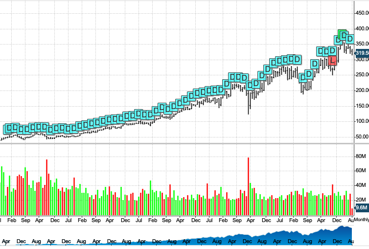

# Stryker: A MedTech giant with a brain using Aartificial Intelligence (AI)

## Overview and Origin

| Name | Stryker Corporation |
|---|---|
| Logo |  |
| Incorporated | 1941 |
| Founded by | Dr. Homer H. Stryker  (1894-1980) |
| Headquarter | Kalamazoo,  Michigan, U.S.A. |
| Chairperson and CEO | Kevin Lobo |
| COO | Timothy Scannell |
| Domain | Medical Devices |
| Website | [stryker.com](https://www.stryker.com/) |

### History
Post his **Doctor of Medicine** degree from [University of Michigan Medical School](https://en.wikipedia.org/wiki/University_of_Michigan_Medical_School), [Dr. Homer Stryker](https://en.wikipedia.org/wiki/Homer_Stryker) started his medical practice in _Orthopedics_ in Borgess Hospiral in Kalamazoo, MI as a sole orthopedic surgeon in the local region.

Between **_1935_** and **_1946_**, Dr. Stryker developed his first few medical devices in his workshop, such as, _a rubber walking heel_ for walking casts, innovative patient bed that reduced bedsores and  few other orthopedic devices.

> **1943** was the year when he created his most famous and innovative medical device named after him, the _"Stryker Saw"_, which is being used to cut plaster cast safely, even today. [^1]

In **1946**, Dr. Stryker founded the predecessor of Stryker Corporation, **Orthopedic Frame Company Inc.** to menufacture and sell his inventions. In **1964**, after his retirement from practicing medicine for 4 decades, he changed his company to **Stryker Corporation**.

### Finance
* Originally The Orthopedic Frame Company was self funded by Dr. Stryker
* It continued to be a privately self-funded company after its name change to Stryker Corporation
* In **1979** Stryker Corporation went for _Initial Public Offering (IPO)_ and acquired **Osteonics Corporation**.
---
## Business Activities

Currently Stryker has expanded its business market from orthopedic medical devices to various other medical fields that can achieve a great success using cutting-edge medical and mechanical technologies, along side the levarage of Artificial Intelligence. Following are the areas where Stryker do their business activities.

1. Acute Care
2. Endoscopy
3. Neurovascular & Neurosurgical
4. Surgical Technologies
5. Foot & Ankle
6. Orthopedic Instruments
7. Craniomaxillofacial
8. Joint Replacement
9. Spine and Interventional Spine

### Target Market
- Doctors and Surgeons
- Patients
- Home-caregivers
- Hospitals

### Market Size [^2]
- 150 million patients worldwide
- 75+ countries

### Unique Selling Point
Stryker is a global leader in medical technologies and offer innovative products and services in MedSurg, Neurotechnology, Orthopaedics and Spine that help improve patient and healthcare outcomes. Stryker is leveraging their 12k+ patents globally as of 2023 to bring innovation to the next level.[^2]

### Tools and Technologies
| Name | Details |
|---|---|
| Cloud services | - Amazon Web Services AWS  -  Google Cloud Platform  - Microsoft Azure |
| Scripting | - Python  - Java  - Javascript |
| Enterprise Software | - SAP   - Azure DevOps |
| Source Control | - GitLab/GitHub |
| Automation | - PLCs, SCADA, HMI, robotics, LabVIEW, MATLAB |

## Landscape

> Stryker Corporation is in Medical Devices field, which has received a great boost from both, conventional and non-conventional funding sources, especially post COVID-19 pandemic. The U.S. MedTech market size was valued at whooping $180 billion in 2023.[^3]

### Trends
- Investment in R&D initiatives is continuously increasing
- Preference towards wearable medical devices is increasing
- Home-care and self-care is getting very popular in health management

### Top 5 Major Players [^4]
5. **Medtronic plc**
    - *Market Cap: $101.3B*
4. **Stryker Corporation**
    - *Market Cap: $104.2B*
3. **Intuitive Surgical, Inc.**
    - *Market Cap: $104.6B*
2. **Pfizer inc.**
    - *Market Cap: $187.2B*
1. **UnitedHealth Group Inc.**
    - *Market Cap: 485.6B*
## Results

Since company have adapted new technology treds their market value has been constantly increasing over last 8 years.[^5]

* According to the 2023 Annual report following are the company performance measures and its results. [^6]
    * **$20.5B** in global sales
    * **52,000** Employees
    * Over **150M** patients impacted
    * **$1.4B** spent in R&D
    * FDA Recalls
        * 2022: 29 - Normalized by revenue $1.58B
        * 2023: 33 - Normalized by revenue $1.68B

## Recommendations

### Exploring Global Partnerships
- Clinical trials in the United States are stringently regulated (of cource for good reasons). Partnering with clinical trial excecution complanies in global market can boost time-to-market significantly.
- Partnering with manufactures of medical sensors, instead of home-built senses can be proven very cost-effective and will result into focused innovation and R&D energy surplus.

### Utilizing latest technology innovations
- Leveraging AI in quality management, especially recent innovations in predictive AI, can significantly reduce FDA recalls and save revenue loss in billions.

- Managing a workforce of 50k plus employees can be made easier with ML and NLP models, which can result in to better employee satisfaction index.

- High-resolution visual AI models will be proven very resouceful in the field of robotic surgery and in virtual patient visits.

---
### References:
- Wikipedia page : [Stryker Corporation](https://en.wikipedia.org/wiki/Stryker_Corporation)
- Financial Data : [SEC filings](https://www.sec.gov/cgi-bin/browse-edgar?action=getcompany&CIK=SYK)
- Technology Data: [Stryker Careers](https://careers.stryker.com/)

1. [^1]: Markman, Jon. ["Early Focus On Surgical Robotics Gives Stryker A Leg Up"](https://www.forbes.com/sites/jonmarkman/2019/08/30/early-focus-on-surgical-robotics-gives-stryker-a-leg-up/). Forbes. Retrieved 2020-06-09.
2. [^2]: Sourced from company website. [stryker.com/us/en/about.html](https://www.stryker.com/us/en/about.html)
3. [^3]: Extracted from Fortune Business Insights report ID: [FBI107009](https://www.fortunebusinessinsights.com/u-s-medical-devices-market-107009)
4. [^4]: Sourced from Insider Monkey article: [Top 5 Medical AI Companies](https://www.insidermonkey.com/blog/top-5-medical-ai-companies-1203900/)
5. [^5]: Image captured from NYSE quote : [SYK](https://www.nyse.com/quote/XNYS:SYK)
6. [^6]: Stryker Annual Report 2023: https://www.stryker.com/us/en/about/annual-review/2023.html